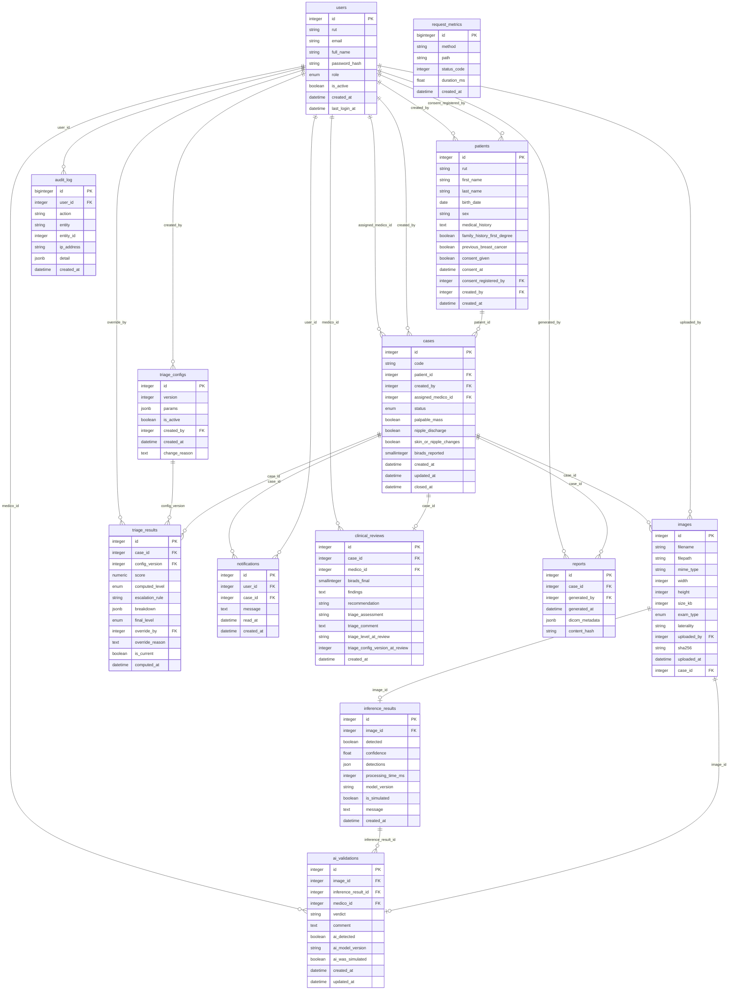

# Modelo de datos — Proyecto Aurora

Generado automáticamente desde los modelos SQLAlchemy con `python -m scripts.gen_docs`. No editar a mano.

## Diccionario de datos

### users

Usuarios de la plataforma y su rol.

| Campo | Tipo | Restricción | Descripción |
|---|---|---|---|
| id | INTEGER | PK, NOT NULL |  |
| rut | VARCHAR(12) | UNIQUE, NOT NULL | RUT del usuario (validado con dígito verificador) |
| email | VARCHAR(150) | UNIQUE, NOT NULL |  |
| full_name | VARCHAR(150) | NOT NULL |  |
| password_hash | VARCHAR | NOT NULL | Hash bcrypt |
| role | ENUM(MEDICO, ADMIN, ADMINISTRATIVO) | NOT NULL | ADMIN, MEDICO o ADMINISTRATIVO |
| is_active | BOOLEAN | NOT NULL, DEFAULT true |  |
| created_at | DATETIME | NULL, DEFAULT now() |  |
| last_login_at | DATETIME | NULL |  |

Índices únicos: `ix_users_email (email)`; `ix_users_rut (rut)`

### patients

Pacientes (datos ficticios en desarrollo) con antecedentes y consentimiento informado.

| Campo | Tipo | Restricción | Descripción |
|---|---|---|---|
| id | INTEGER | PK, NOT NULL |  |
| rut | VARCHAR(12) | UNIQUE, NOT NULL |  |
| first_name | VARCHAR(100) | NOT NULL |  |
| last_name | VARCHAR(100) | NOT NULL |  |
| birth_date | DATE | NOT NULL |  |
| sex | VARCHAR(1) | NULL |  |
| medical_history | TEXT | NULL |  |
| family_history_first_degree | BOOLEAN | NOT NULL, DEFAULT false |  |
| previous_breast_cancer | BOOLEAN | NOT NULL, DEFAULT false |  |
| consent_given | BOOLEAN | NOT NULL, DEFAULT false | Consentimiento informado registrado (obligatorio para crear casos) |
| consent_at | DATETIME | NULL |  |
| consent_registered_by | INTEGER | FK → users.id, NULL | Usuario que registró el consentimiento |
| created_by | INTEGER | FK → users.id, NULL |  |
| created_at | DATETIME | NULL, DEFAULT now() |  |

CHECK: `sex IN ('F','M','O')`

Índices únicos: `ix_patients_rut (rut)`

### cases

Casos clínicos con código anónimo, estado, síntomas y BI-RADS informado.

| Campo | Tipo | Restricción | Descripción |
|---|---|---|---|
| id | INTEGER | PK, NOT NULL |  |
| code | VARCHAR(20) | UNIQUE, NOT NULL | Código anónimo AUR-AAAA-NNNNNN (secuencia case_code_seq) |
| patient_id | INTEGER | FK → patients.id, NOT NULL |  |
| created_by | INTEGER | FK → users.id, NOT NULL |  |
| assigned_medico_id | INTEGER | FK → users.id, NULL |  |
| status | ENUM(ABIERTO, PRIORIZADO, EN_REVISION, CERRADO) | NOT NULL, DEFAULT ABIERTO | ABIERTO, PRIORIZADO, EN_REVISION o CERRADO |
| palpable_mass | BOOLEAN | NOT NULL, DEFAULT false |  |
| nipple_discharge | BOOLEAN | NOT NULL, DEFAULT false |  |
| skin_or_nipple_changes | BOOLEAN | NOT NULL, DEFAULT false |  |
| birads_reported | SMALLINT | NULL | BI-RADS informado (0–6) |
| created_at | DATETIME | NULL, DEFAULT now() |  |
| updated_at | DATETIME | NULL, DEFAULT now() |  |
| closed_at | DATETIME | NULL |  |

CHECK: `birads_reported BETWEEN 0 AND 6`

### images

Imágenes del caso (archivo cifrado en el StorageBackend).

| Campo | Tipo | Restricción | Descripción |
|---|---|---|---|
| id | INTEGER | PK, NOT NULL |  |
| filename | VARCHAR | NOT NULL |  |
| filepath | VARCHAR | NOT NULL | Clave del archivo cifrado (nombre aleatorio) |
| mime_type | VARCHAR | NOT NULL |  |
| width | INTEGER | NULL |  |
| height | INTEGER | NULL |  |
| size_kb | INTEGER | NULL |  |
| exam_type | ENUM(MAMOGRAFIA, ECOGRAFIA, OTRO) | NOT NULL, DEFAULT MAMOGRAFIA |  |
| laterality | VARCHAR(1) | NULL |  |
| uploaded_by | INTEGER | FK → users.id, NULL |  |
| sha256 | VARCHAR(64) | NULL | SHA-256 del archivo original (integridad) |
| uploaded_at | DATETIME | NULL, DEFAULT now() |  |
| case_id | INTEGER | FK → cases.id, NOT NULL |  |

CHECK: `laterality IN ('L','R')`

### inference_results

Resultado del proveedor de IA por imagen (marcado si es simulado).

| Campo | Tipo | Restricción | Descripción |
|---|---|---|---|
| id | INTEGER | PK, NOT NULL |  |
| image_id | INTEGER | FK → images.id, UNIQUE, NOT NULL |  |
| detected | BOOLEAN | NOT NULL |  |
| confidence | FLOAT | NOT NULL |  |
| detections | JSON | NULL |  |
| processing_time_ms | INTEGER | NOT NULL |  |
| model_version | VARCHAR | NOT NULL |  |
| is_simulated | BOOLEAN | NOT NULL, DEFAULT true | true si lo generó el proveedor simulado |
| message | TEXT | NOT NULL |  |
| created_at | DATETIME | NULL, DEFAULT now() |  |

### triage_configs

Versiones de los parámetros de triage (una activa).

| Campo | Tipo | Restricción | Descripción |
|---|---|---|---|
| id | INTEGER | PK, NOT NULL |  |
| version | INTEGER | UNIQUE, NOT NULL |  |
| params | JSONB | NOT NULL |  |
| is_active | BOOLEAN | NOT NULL, DEFAULT false |  |
| created_by | INTEGER | FK → users.id, NULL |  |
| created_at | DATETIME | NULL, DEFAULT now() |  |
| change_reason | TEXT | NOT NULL |  |

Índices únicos: `uq_triage_configs_active (is_active) WHERE is_active`

### triage_results

Cálculos de triage por caso; uno vigente y el resto como historial.

| Campo | Tipo | Restricción | Descripción |
|---|---|---|---|
| id | INTEGER | PK, NOT NULL |  |
| case_id | INTEGER | FK → cases.id, NOT NULL |  |
| config_version | INTEGER | FK → triage_configs.version, NOT NULL |  |
| score | NUMERIC(5, 2) | NOT NULL |  |
| computed_level | ENUM(ALTA, MEDIA, BAJA) | NOT NULL |  |
| escalation_rule | VARCHAR(50) | NULL |  |
| breakdown | JSONB | NULL | Aporte de cada factor y regla disparada |
| final_level | ENUM(ALTA, MEDIA, BAJA) | NOT NULL | Nivel vigente: el calculado o el fijado por override |
| override_by | INTEGER | FK → users.id, NULL |  |
| override_reason | TEXT | NULL |  |
| is_current | BOOLEAN | NOT NULL, DEFAULT true |  |
| computed_at | DATETIME | NOT NULL, DEFAULT now() |  |

CHECK: `override_by IS NULL OR (override_reason IS NOT NULL AND length(trim(override_reason)) > 0)`; `score >= 0 AND score <= 100`

Índices únicos: `uq_triage_results_current (case_id) WHERE is_current`

### notifications

Avisos a médicos cuando un caso queda en ALTA.

| Campo | Tipo | Restricción | Descripción |
|---|---|---|---|
| id | INTEGER | PK, NOT NULL |  |
| user_id | INTEGER | FK → users.id, NOT NULL |  |
| case_id | INTEGER | FK → cases.id, NOT NULL |  |
| message | TEXT | NOT NULL |  |
| read_at | DATETIME | NULL |  |
| created_at | DATETIME | NULL, DEFAULT now() |  |

### clinical_reviews

Revisión médica que cierra el caso.

| Campo | Tipo | Restricción | Descripción |
|---|---|---|---|
| id | INTEGER | PK, NOT NULL |  |
| case_id | INTEGER | FK → cases.id, UNIQUE, NOT NULL |  |
| medico_id | INTEGER | FK → users.id, NOT NULL |  |
| birads_final | SMALLINT | NOT NULL |  |
| findings | TEXT | NOT NULL |  |
| recommendation | VARCHAR(30) | NOT NULL |  |
| triage_assessment | VARCHAR(15) | NULL |  |
| triage_comment | TEXT | NULL |  |
| triage_level_at_review | VARCHAR(5) | NULL |  |
| triage_config_version_at_review | INTEGER | NULL |  |
| created_at | DATETIME | NULL, DEFAULT now() |  |

CHECK: `triage_assessment IN ('APROPIADO','SOBREESTIMADO','SUBESTIMADO')`; `birads_final BETWEEN 0 AND 6`; `recommendation IN ('CONTROL_RUTINA','CONTROL_6_MESES','ESTUDIO_COMPLEMENTARIO','BIOPSIA','DERIVACION')`

### reports

Registro de cada PDF generado (SHA-256 y metadatos tipo DICOM).

| Campo | Tipo | Restricción | Descripción |
|---|---|---|---|
| id | INTEGER | PK, NOT NULL |  |
| case_id | INTEGER | FK → cases.id, NOT NULL |  |
| generated_by | INTEGER | FK → users.id, NOT NULL |  |
| generated_at | DATETIME | NULL, DEFAULT now() |  |
| dicom_metadata | JSONB | NOT NULL | PatientID (= código del caso), StudyDate, Modality=MG, hallazgos (SC-02) |
| content_hash | VARCHAR(64) | NOT NULL | SHA-256 del PDF generado en el frontend |

### audit_log

Bitácora append-only de accesos y cambios (trigger bloquea UPDATE/DELETE).

| Campo | Tipo | Restricción | Descripción |
|---|---|---|---|
| id | BIGINT | PK, NOT NULL |  |
| user_id | INTEGER | FK → users.id, NULL |  |
| action | VARCHAR(40) | NOT NULL |  |
| entity | VARCHAR(30) | NOT NULL |  |
| entity_id | INTEGER | NULL |  |
| ip_address | VARCHAR(45) | NULL |  |
| detail | JSONB | NULL | Contexto de la acción, sin datos sensibles en claro |
| created_at | DATETIME | NULL, DEFAULT now() |  |

### request_metrics

Duración de cada request de la API (p95 del dashboard).

| Campo | Tipo | Restricción | Descripción |
|---|---|---|---|
| id | BIGINT | PK, NOT NULL |  |
| method | VARCHAR(10) | NOT NULL |  |
| path | VARCHAR(200) | NOT NULL |  |
| status_code | INTEGER | NOT NULL |  |
| duration_ms | FLOAT | NOT NULL |  |
| created_at | DATETIME | NULL, DEFAULT now() |  |

### ai_validations

| Campo | Tipo | Restricción | Descripción |
|---|---|---|---|
| id | INTEGER | PK, NOT NULL |  |
| image_id | INTEGER | FK → images.id, UNIQUE, NOT NULL |  |
| inference_result_id | INTEGER | FK → inference_results.id, NOT NULL |  |
| medico_id | INTEGER | FK → users.id, NOT NULL |  |
| verdict | VARCHAR(20) | NOT NULL |  |
| comment | TEXT | NULL |  |
| ai_detected | BOOLEAN | NOT NULL |  |
| ai_model_version | VARCHAR | NOT NULL |  |
| ai_was_simulated | BOOLEAN | NOT NULL |  |
| created_at | DATETIME | NULL, DEFAULT now() |  |
| updated_at | DATETIME | NULL, DEFAULT now() |  |

CHECK: `verdict IN ('CONCORDANTE','FALSO_POSITIVO','FALSO_NEGATIVO','NO_EVALUABLE')`

## Diagrama entidad-relación

